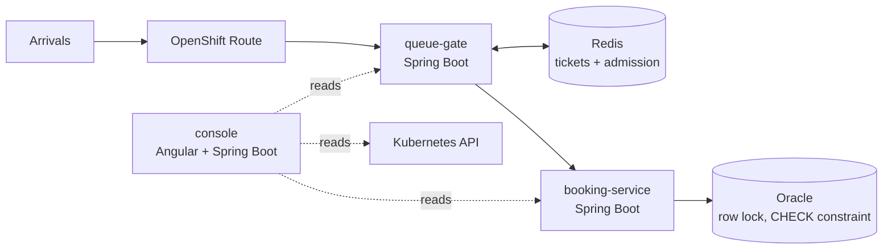
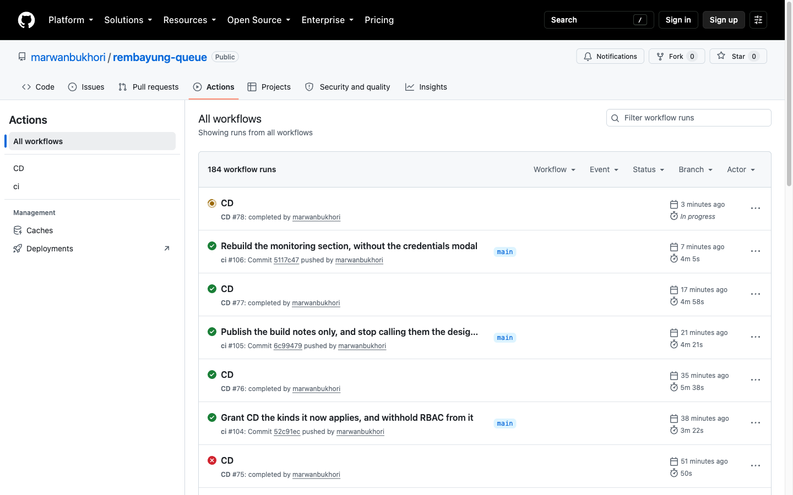

# Rembayung Booking Queue

A restaurant booking system built to survive its own busiest second — and to prove
it did, rather than assert it.

It models a real failure. A Malaysian restaurant opened reservations at 21:00 each
night; the platform fell over at roughly three thousand attempts, and scalpers
took seats that had already been sold. Two failures, not one: the site went down,
**and** it sold the same table twice.

This rebuilds that moment as something you can run, watch, and check.

> **Live console:** https://console-marwanbukhori-dev.apps.rm3.7wse.p1.openshiftapps.com
> The pages read live cluster state and need an access key, which is shared
> directly rather than committed here — the console can start real load runs
> against a real namespace.

---

## What it claims, and the measurement behind it

Every number here was taken from the deployed system, not from a design document.

| Claim | How it was verified |
|---|---|
| **Never oversells** | Filled one slot to its exact boundary under 6-way concurrency: **125 bookings succeeded, 19 were refused with 409, seats landed on exactly 250.** Not 249, not 251. `oversold` read 0 at every sample. |
| **Sheds load instead of collapsing** | 200 concurrent customers against a 20-connection pool: **186 rejections, every one a deliberate 503**, zero errors, `oversold` still 0. |
| **Returns unpaid seats** | Holds expire after 10 minutes; the sweeper reclaimed **250 seats back to 0** with the invariant never breaking during the reclaim. |
| **The bottleneck is contention, by design** | `SELECT … FOR UPDATE` serialises every booking for a slot on one row. Measured across 125 claims: **median 2,268 ms, p95 5,187 ms** waiting on that lock. |
| **The tests are real** | **203 tests** across three services, run against **a real Oracle database** in Testcontainers — not an in-memory substitute. |

The oversell guard is a database constraint, not application logic:

```sql
CONSTRAINT ck_slots_seats CHECK (seats_taken >= 0 AND seats_taken <= capacity)
```

Application bugs cannot get past it. That is the point — the invariant lives where
it cannot be bypassed by the next person to touch the code.

---

## How it holds together



**queue-gate** issues a ticket per arrival and admits them at a fixed rate, so the
crowd is metered before it reaches the database. Admission is a pure function of
elapsed time — `floor((now − opensAt) × rate)` — so no queue state has to be
stored or coordinated.

**booking-service** takes a pessimistic row lock per slot. That makes bookings for
one slot strictly serial, which is slow on purpose: about one booking per second.
Correctness is the constraint being optimised for, and the queue in front is what
makes that acceptable.

**console** is the demo surface. It reads the drop, the pods, the quota and the
autoscalers live, and can start a k6 load run as a Kubernetes Job.

---

## The stack, and why each piece is here

| | | |
|---|---|---|
| **Java 25 · Spring Boot 4.1.1** | services | Current, not comfortable. Boot 4 ships Jackson 3 (`tools.jackson`), which is its own small migration. |
| **Oracle 23ai · Autonomous** | database | The constraint and the row lock both live here. Tests run against real Oracle in Testcontainers. |
| **Redis** | tickets, admission | `INCR` is atomic, and `GETDEL` makes a token single-use with no check-then-act window. |
| **Angular 20.3** | console UI | Signals and standalone components; no state library. |
| **OpenShift** | platform | `restricted-v2` SCC only, namespaced quota, HPAs — a constrained cluster, not a permissive one. |
| **Ansible** | deployment | Renders and applies manifests, waits for the rollout, smoke-tests the public route, and **rolls back on its own** if it fails. |
| **GitHub Actions** | CI/CD | Every commit tested, built per service, and deployed. CD is separate from CI so a rollback needs no rebuild. |
| **k6** | load | Runs in-cluster as a Job, so the load is subject to the same quota as everything else. |
| **Splunk** | logs | Every pod's structured events over HEC — what happened. |
| **Dynatrace** | traces | Application-only OneAgent — where the time went. |

---

## The parts worth reading

The build notes are the honest record: what broke, what the measurement said, and
which assumption turned out to be wrong. They are also served inside the console.

- [`docs/notes/`](docs/notes) — one note per phase, written while building it
- [`docs/superpowers/specs/`](docs/superpowers/specs) — what was agreed before any code existed
- [`docs/superpowers/plans/`](docs/superpowers/plans) — the task-by-task plan each phase was executed against
- [`deploy/README.md`](deploy/README.md) — the cluster, the RBAC, and how a deploy actually works

A few things in there that were genuinely surprising:

- Readiness probes that included the database **emptied the Service during overload** — the
  correct response to a busy database is 503, not disappearing.
- k6 counted deliberate 503s as failures, reporting 100% failure for a system behaving exactly as designed.
- The deploy pipeline wrote only the container image for 81 commits. Every other field
  in a manifest — env, probes, RBAC — reached the cluster only when a human remembered.
  A committed, CI-green, deployed change could do nothing at all.

---

## Running it

```bash
# Everything except OpenShift, locally
docker compose up -d

# Tests, per service — needs Docker for Testcontainers
cd booking-service && ./mvnw verify
cd queue-gate      && ./mvnw verify
cd console         && ./mvnw verify

# Does the cluster still match what git says it should?
deploy/scripts/check-drift.sh
```

Each service carries its own Maven wrapper; there is no root `mvnw`.

---

## Continuous delivery



CI runs the full suite against real Oracle, then builds and publishes one image
per service to `ghcr.io`. CD renders the Kustomize overlay pinned to the commit
being deployed, applies it, waits for the rollout, smoke-tests the public route,
and restores the previous images if any of that fails.

The deploy identity is a ServiceAccount with no `delete` verb on anything, and no
access to Secrets, pods or RBAC — see [`deploy/openshift/cd-serviceaccount.yaml`](deploy/openshift/cd-serviceaccount.yaml).
